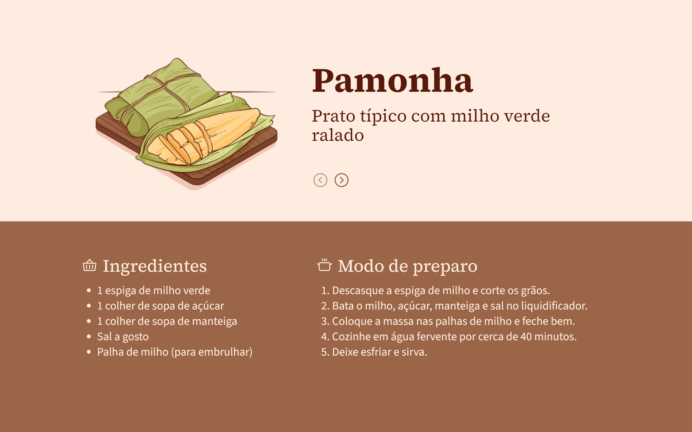

<h1 align="center"> Receitas Juninas </h1>

[Click here to access](https://june-recipes.vercel.app/)

## 🚀 Technologies

This project was developed with the follow technologies:

- [React.js](https://react.dev/)
- [Tailwind CSS](https://tailwindcss.com/)
- Git and GitHub

## 💻 Project

The webpage "June Recipes" shows the typical foods of the June festivities, their ingredients and how to prepare them. 

Main features:

- Responsive layout (Adapted for smaller screens);
- Buttons to switch recipes;
- Active effect.

